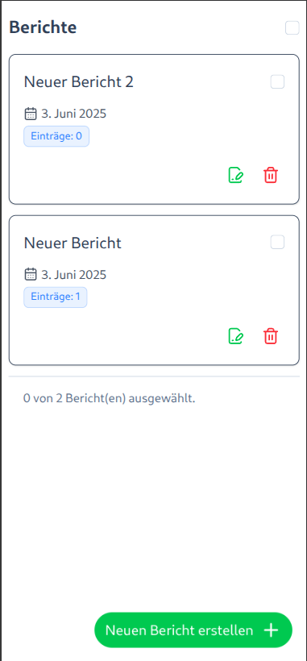
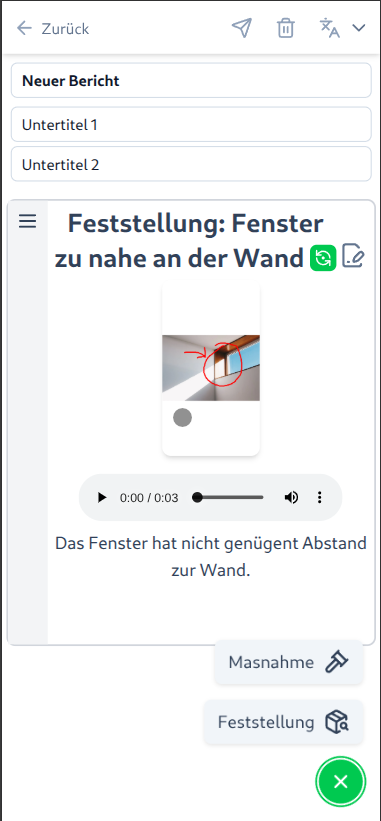
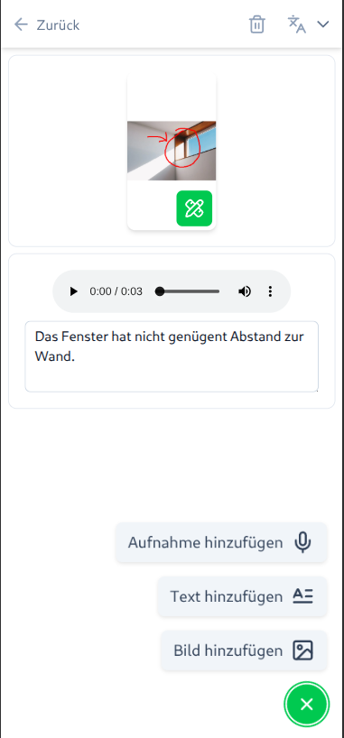
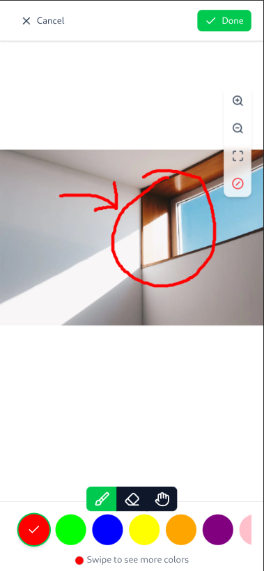

# Bericht Generator (Frontend)

<div align="center">
  
  
  
  
</div>

Bericht Generator is a modern web application for creating comprehensive reports with multimedia content. Built with Nuxt.js and TypeScript, it provides an intuitive interface for recording complaints, capturing evidence, and generating professional reports. This repository contains only the frontend code; the backend is available separately.


[](https://biomejs.dev)

## Features

- **Audio Recording**: Record complaints with automatic speech-to-text transcription
- **Image Capture**: Take photos and annotate them with drawing tools
- **Text Composition**: Create detailed text-based complaint entries
- **Interactive Drawing**: Annotate images with brush tools, colors, and eraser functionality
- **Location & GPS Integration**: Capture precise location data with interactive maps and automatic GPS positioning
- **Report Management**: Organize complaints into structured reports
- **Document Export**: Generate DOCX documents and email exports
- **Drag & Drop Interface**: Reorder complaint items within reports
- **PWA Support**: Progressive Web App capabilities for mobile usage
- **Multilingual Support**: Available in German and English

## Technology Stack

- **Frontend**: [Nuxt.js](https://nuxt.com/) with TypeScript and Composition API
- **UI Framework**: [Nuxt UI](https://ui.nuxt.com/)
- **Drawing Engine**: [Konva.js](https://konvajs.org/) with Vue Konva
- **Maps & Location**: [Leaflet](https://leafletjs.com/) with OpenStreetMap and Nominatim for geocoding
- **Audio Processing**: MediaRecorder API with FFmpeg for format conversion
- **Package Manager**: [Bun](https://bun.sh/)
- **Internationalization**: Nuxt I18n
- **Document Generation**: Docx.js for Word document creation
- **State Management**: Pinia
- **Gesture Support**: VueUse for touch interactions

## Setup

### Environment Configuration

Create a `.env` file in the project root with the required environment variables:

```
API_URL=http://localhost:8000
```

### Install Dependencies

Make sure to install dependencies using Bun:

```bash
bun install
```

## Development

Start the development server on `http://localhost:3000`:

```bash
bun run dev
```

For production builds:

```bash
bun run build
bun run start
```

Generate static site:

```bash
bun run generate
```

### Backend Setup

This frontend requires a compatible backend API for full functionality.
See the [Bericht Backend](https://github.com/DCC-BS/bericht-backend) repository for the backend implementation.
Ensure the backend is running and accessible at the URL specified in your `.env` file.

## Testing & Linting

Run tests with Vitest:

```bash
# Run tests
bun test

# Run tests in watch mode
bun test:watch

# Generate coverage report
bun test:coverage
```

Format code with Biome:

```bash
bun run lint
```

Check and fix code issues:

```bash
bun run check
```

## Docker Deployment

The application includes a multi-stage Dockerfile for production deployment:

```bash
# Build the Docker image
docker build -t bericht-frontend .

# Run the container
docker run -p 3000:3000 bericht-frontend
```

## Project Architecture

- `components/`: Vue components organized by feature (complaints, drawing, navigation)
- `composables/`: Reusable composition functions for business logic
- `pages/`: Application routes and page components
- `models/`: TypeScript interfaces and data models
- `services/`: API service classes for data operations
- `utils/`: Utility functions for document generation and helpers
- `assets/`: CSS styles and static assets
- `i18n/`: Internationalization configuration and translations
- `server/`: Server-side API endpoints and middleware

## Key Features

### Audio Recording
- Real-time audio visualization during recording
- Automatic conversion to MP3 format
- Background recording support for PWA
- Speech-to-text integration

### Image Drawing
- Multi-touch gesture support (pinch to zoom, pan)
- Brush and eraser tools with customizable sizes
- Color picker with preset colors
- Touch-optimized interface for mobile devices

### Location & GPS Features
- Automatic GPS positioning with animated loading states
- Interactive map with draggable markers for precise location adjustment
- Reverse geocoding to convert coordinates to readable addresses
- OpenStreetMap integration with tile layer support
- Debounced API calls to prevent rate limiting
- Cross-platform geolocation support with error handling

### Report Generation
- Drag and drop reordering of complaint items
- Export to DOCX format with embedded images
- Email export functionality
- Structured complaint organization
- Location data included in reports

## Browser Support

- Modern browsers with ES2020+ support
- MediaRecorder API for audio recording
- Canvas API for drawing functionality
- Touch events for mobile interaction
- HTML5 Geolocation API for GPS positioning
- WebGL support for map rendering

## License

[MIT](LICENSE) © Data Competence Center Basel-Stadt

<a href="https://www.bs.ch/schwerpunkte/daten/databs/schwerpunkte/datenwissenschaften-und-ki"></a>

Datenwissenschaften und KI <br>
Developed with ❤️ by Data Alchemy Team

